# Entity-Component-System Benchmarks

[](https://github.com/abeimler/ecs_benchmark/actions)


This repository contains a collection of benchmarks for popular Entity-Component-System (ECS) frameworks.
The benchmarks cover different aspects of ECS frameworks, such as update systems, component additions/removals, and entity creation/destruction.
It's important to note that different ECS frameworks have different strengths and weaknesses.
For example, some frameworks might excel in adding/removing components, while others might be better at creating/destroying entities or have query support.
Therefore, it's crucial to choose an ECS framework based on your specific requirements.

ECS (Entity-Component-System) Frameworks:

- [EntityX](https://github.com/alecthomas/entityx)
- [EnTT](https://github.com/skypjack/entt)
- [Ginseng](https://github.com/apples/ginseng)
- [flecs](https://github.com/SanderMertens/flecs)
- [pico_ecs](https://github.com/empyreanx/pico_headers)
- [gaia-ecs](https://github.com/richardbiely/gaia-ecs)
- SnapECS (local implementation)

SnapECS is reported as two framework configurations. **SnapECS (Indexed)** keeps component data in the source
table and resolves it by entity ID while a system iterates its view. **SnapECS (Cached)** copies component data
into system-view buffers; writes made by systems are synchronized back to the source table. Both configurations
continue to store `EmptyComponent` as a tag.

The SnapECS entity-only executables are also registered for both policies so report inputs remain symmetrical.
Those benchmarks use a World with no systems, so no system view is built and both policies follow the same
source-table entity/component API path.

mustache is excluded from this report because its full-range Release benchmark corrupts the heap on MinGW at `BM_SystemsUpdate/2048`.

## TL;DR Results

Main feature of an ECS is the iterating over a lot of entities and using system to update the components.
The results of these benchmarks should be used as a starting point for your own benchmarking efforts.

### Steady update (for-each entities (with mixed components) in 7 systems)

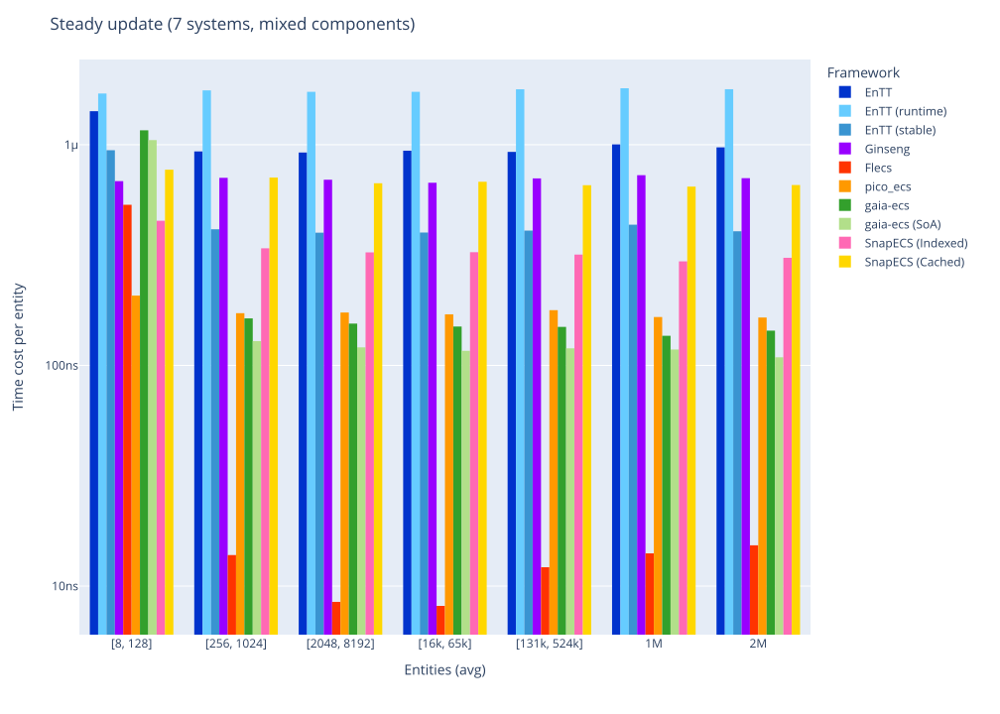

_Graph shows cost per entity, tables shows total cost. lower is faster._

|                                          | EnTT    | EnTT (runtime) | EnTT (stable) | Ginseng | Flecs  | pico_ecs | gaia-ecs | gaia-ecs (SoA) | SnapECS (Indexed) | SnapECS (Cached) |
| :--------------------------------------- | :------ | :------------- | :------------ | :------ | :----- | :------- | :------- | :------------- | :---------------- | :--------------- |
| Steady update 1 entities with 7 systems  | 3367ns  | 2774ns         | 3142ns        | 1049ns  | 1651ns | 394ns    | 3477ns   | 3096ns         | 994ns             | 1249ns           |
| Steady update 4 entities with 7 systems  | 6618ns  | 8015ns         | 4444ns        | 3552ns  | 2964ns | 909ns    | 6928ns   | 6563ns         | 2206ns            | 3925ns           |
| Steady update 8 entities with 7 systems  | 10365ns | 15604ns        | 6426ns        | 5864ns  | 3033ns | 1665ns   | 7503ns   | 7151ns         | 3568ns            | 6519ns           |
| Steady update 16 entities with 7 systems | 11174ns | 17828ns        | 3809ns        | 7190ns  | 2800ns | 2247ns   | 5972ns   | 5490ns         | 3904ns            | 7952ns           |
| Steady update 32 entities with 7 systems | 21201ns | 32908ns        | 4518ns        | 13586ns | 2740ns | 3956ns   | 7599ns   | 6443ns         | 6739ns            | 13289ns          |
| Steady update 64 entities with 7 systems | 32921ns | 62020ns        | 5941ns        | 25054ns | 3392ns | 8032ns   | 10139ns  | 8203ns         | 12280ns           | 26056ns          |

|                                            | EnTT    | EnTT (runtime) | EnTT (stable) | Ginseng | Flecs | pico_ecs | gaia-ecs | gaia-ecs (SoA) | SnapECS (Indexed) | SnapECS (Cached) |
| :----------------------------------------- | :------ | :------------- | :------------ | :------ | :---- | :------- | :------- | :------------- | :---------------- | :--------------- |
| Steady update 256 entities with 7 systems  | 238us   | 450us          | 108us         | 184us   | 4us   | 45us     | 41us     | 33us           | 85us              | 181us            |
| Steady update ~1K entities with 7 systems  | 949us   | 1779us         | 416us         | 726us   | 10us  | 173us    | 167us    | 132us          | 345us             | 710us            |
| Steady update ~4K entities with 7 systems  | 3907us  | 7091us         | 1616us        | 2735us  | 29us  | 706us    | 636us    | 488us          | 1271us            | 2683us           |
| Steady update ~16K entities with 7 systems | 14911us | 27037us        | 6415us        | 11063us | 132us | 2895us   | 2569us   | 1925us         | 5274us            | 10910us          |

|                                            | EnTT   | EnTT (runtime) | EnTT (stable) | Ginseng | Flecs | pico_ecs | gaia-ecs | gaia-ecs (SoA) | SnapECS (Indexed) | SnapECS (Cached) |
| :----------------------------------------- | :----- | :------------- | :------------ | :------ | :---- | :------- | :------- | :------------- | :---------------- | :--------------- |
| Steady update ~65K entities with 7 systems | 60ms   | 116ms          | 26ms          | 43ms    | 0ms   | 10ms     | 9ms      | 7ms            | 21ms              | 44ms             |
| Steady update 262K entities with 7 systems | 249ms  | 476ms          | 106ms         | 183ms   | 3ms   | 46ms     | 37ms     | 30ms           | 86ms              | 175ms            |
| Steady update ~1M entities with 7 systems  | 1052ms | 1890ms         | 455ms         | 763ms   | 14ms  | 173ms    | 142ms    | 123ms          | 310ms             | 677ms            |
| Steady update ~2M entities with 7 systems  | 2040ms | 3743ms         | 850ms         | 1479ms  | 32ms  | 345ms    | 301ms    | 228ms          | 644ms             | 1377ms           |

While this benchmark only includes up to 6 components and 7 small systems,
it's important to note that Entity-Component-Systems can become much more complex in the wild,
with hundreds of components and systems.
Therefore, it's crucial to always benchmark your specific cases and systems when necessary and compare results.
Choose an ECS framework based on its features.
For example, EnTT offers [resource management](https://github.com/skypjack/entt/wiki/Crash-Course:-resource-management),
while flecs provides useful [add-ons](https://github.com/SanderMertens/flecs#addons) and [querying](https://github.com/SanderMertens/flecs/tree/master/examples/cpp/queries/basics),
and EntityX includes a built-in [world/system manager](https://github.com/alecthomas/entityx#manager-tying-it-all-together=).

To evaluate a framework, look at the examples and API design, and pick the one that suits your needs.

## Details

### Features

All benchmarks are located in the [`benchmark/benchmarks/`](benchmark/benchmarks/) directory and write with with the [google/benchmark](https://github.com/google/benchmark) library.
Each benchmark uses an example application for each framework (see [`src/`](src) directory), and every example application has specific base features implemented (see [`src/base`](src/base)).

#### Components

1. `PositionComponent`: includes `x` and `y` coordinates.
2. `VelocityComponent`: includes `x` and `y` coordinates for movement.
3. `DataComponent`: includes some arbitrary data.
4. `HealthComponent`: Hero/Monster data includes HP/MaxHP and status.
5. `DamageComponent`: Hero/Monster data includes damage.
6. `SpriteComponent`: Hero/Monster ASCII character as sprite.

#### Systems

1. `MovementSystem`: updates the `PositionComponent` with a constant `VelocityComponent`.
2. `DataSystem`: updates the `DataComponent` with arbitrary data.
3. `MoreComplexSystem`: updates components with random data and arbitrary information.
4. `HealthSystem`: update Hero/Monster health (update HP and status).
5. `DamageSystem`: update Hero/Monster health by taking damage.
6. `SpriteSystem`: update Hero/Monster ASCII character depending on health and type.
7. `RenderSystem`: "render"(write) Hero/Monster character sprite into a "frame buffer"(string buffer).

#### Cold and steady update measurements

Every existing `*SystemsUpdate` benchmark performs one untimed `app.update()` after entity/component setup and
then measures subsequent updates. These results therefore represent **steady update** after the ECS has had an
opportunity to construct or populate its views.

SnapECS additionally provides `*SystemsFirstUpdate` benchmarks. Every measured iteration creates and populates a
fresh World while timing is paused, then measures exactly the first `app.update()` and tears the World down while
timing is paused. Each entity range uses three fixed iterations. A FirstUpdate result is not pure view-build time:
it includes **cold view build: one complete system-logic pass**.

## Additional Benchmarks

Benchmarks for more common features, such as "Creating entities", "Adding and removing components", and others.

### Features tested

- Entity Creation
- Entity Destruction
- Component Retrieval
- Adding and removing components
- Iterating entities/quires

### Environment

- **OS:** Windows
- **CPU:** 3.00GHz @ 22Cores
- **RAM:** 31.50GB

---

### Create entities

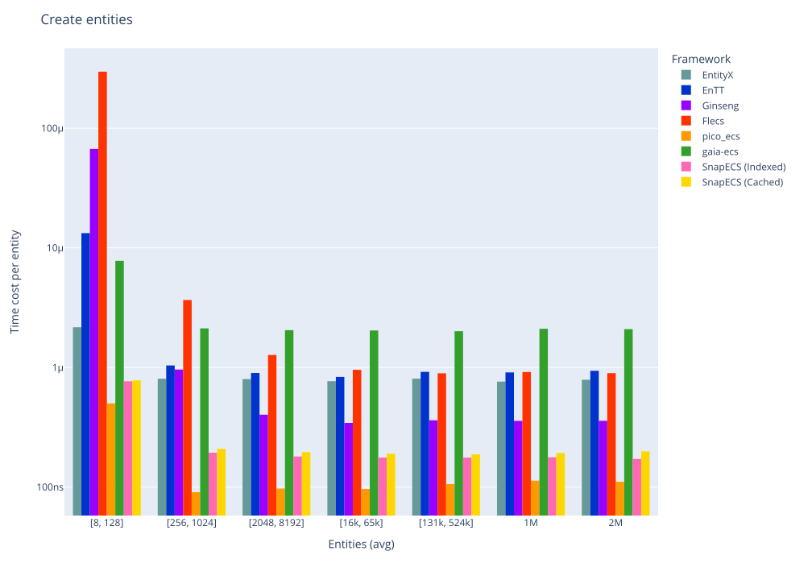

_Graph shows cost per entity, tables shows total cost. lower is faster._

|                                        | EntityX | EnTT     | Ginseng  | Flecs     | pico_ecs | gaia-ecs | SnapECS (Indexed) | SnapECS (Cached) |
| :------------------------------------- | :------ | :------- | :------- | :-------- | :------- | :------- | :---------------- | :--------------- |
| Create 1 entities with two Components  | 5714ns  | 50536ns  | 265301ns | 1192631ns | 1716ns   | 24430ns  | 1761ns            | 1775ns           |
| Create 4 entities with two Components  | 9631ns  | 52627ns  | 272550ns | 1189398ns | 2024ns   | 31608ns  | 3781ns            | 3830ns           |
| Create 8 entities with two Components  | 12833ns | 59709ns  | 270073ns | 1229826ns | 2427ns   | 41861ns  | 5471ns            | 5622ns           |
| Create 16 entities with two Components | 21813ns | 64734ns  | 268719ns | 1192220ns | 3088ns   | 59082ns  | 8043ns            | 7696ns           |
| Create 32 entities with two Components | 33734ns | 75236ns  | 289135ns | 1224474ns | 4661ns   | 89914ns  | 11651ns           | 11568ns          |
| Create 64 entities with two Components | 59631ns | 105129ns | 300978ns | 1232861ns | 7427ns   | 160823ns | 18808ns           | 18736ns          |

|                                          | EntityX | EnTT    | Ginseng | Flecs   | pico_ecs | gaia-ecs | SnapECS (Indexed) | SnapECS (Cached) |
| :--------------------------------------- | :------ | :------ | :------ | :------ | :------- | :------- | :---------------- | :--------------- |
| Create 256 entities with two Components  | 212us   | 286us   | 358us   | 1440us  | 23us     | 559us    | 51us              | 55us             |
| Create ~1K entities with two Components  | 783us   | 987us   | 611us   | 2137us  | 90us     | 2096us   | 184us             | 199us            |
| Create ~4K entities with two Components  | 3259us  | 3735us  | 1672us  | 4988us  | 406us    | 8475us   | 739us             | 820us            |
| Create ~16K entities with two Components | 12321us | 14213us | 5452us  | 16783us | 1605us   | 33259us  | 2848us            | 3104us           |

|                                          | EntityX | EnTT   | Ginseng | Flecs  | pico_ecs | gaia-ecs | SnapECS (Indexed) | SnapECS (Cached) |
| :--------------------------------------- | :------ | :----- | :------ | :----- | :------- | :------- | :---------------- | :--------------- |
| Create ~65K entities with two Components | 49ms    | 52ms   | 23ms    | 60ms   | 6ms      | 135ms    | 11ms              | 12ms             |
| Create 262K entities with two Components | 217ms   | 242ms  | 97ms    | 234ms  | 29ms     | 508ms    | 46ms              | 49ms             |
| Create ~1M entities with two Components  | 798ms   | 953ms  | 375ms   | 961ms  | 118ms    | 2208ms   | 186ms             | 202ms            |
| Create ~2M entities with two Components  | 1656ms  | 1966ms | 751ms   | 1880ms | 232ms    | 4385ms   | 360ms             | 416ms            |

### Destroy entities

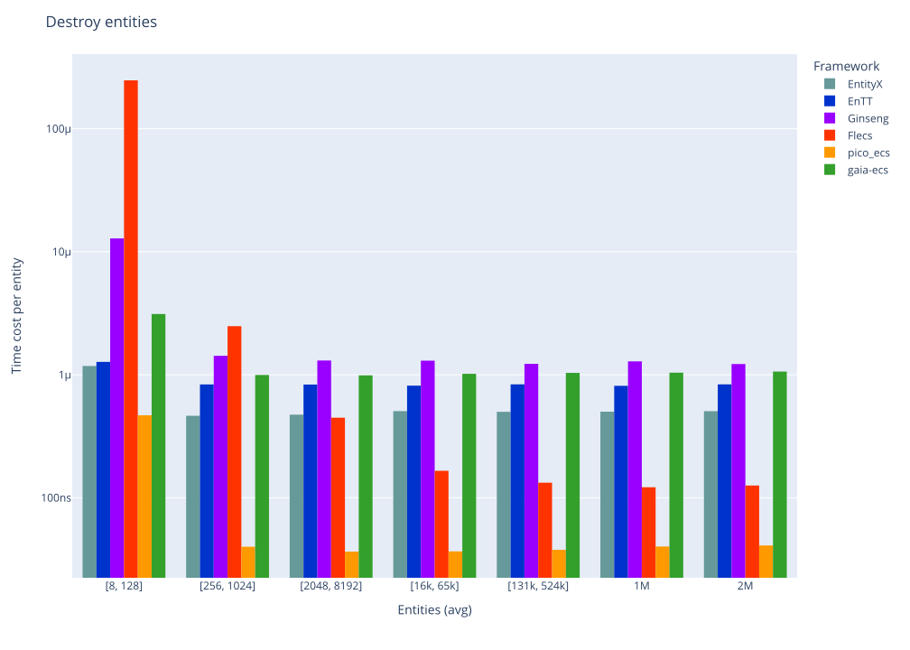

_Graph shows cost per entity, tables shows total cost. lower is faster._

|                                         | EntityX | EnTT    | Ginseng  | Flecs     | pico_ecs | gaia-ecs |
| :-------------------------------------- | :------ | :------ | :------- | :-------- | :------- | :------- |
| Destroy 1 entities with two components  | 3357ns  | 2574ns  | 46326ns  | 1008969ns | 1834ns   | 9340ns   |
| Destroy 4 entities with two components  | 4819ns  | 5178ns  | 54607ns  | 962979ns  | 1868ns   | 12591ns  |
| Destroy 8 entities with two components  | 6589ns  | 8478ns  | 57965ns  | 987372ns  | 1940ns   | 16961ns  |
| Destroy 16 entities with two components | 10211ns | 15251ns | 67683ns  | 995603ns  | 2248ns   | 25611ns  |
| Destroy 32 entities with two components | 18040ns | 28393ns | 83969ns  | 1025165ns | 2801ns   | 42228ns  |
| Destroy 64 entities with two components | 34945ns | 54371ns | 141003ns | 1026560ns | 4048ns   | 76826ns  |

|                                           | EntityX | EnTT    | Ginseng | Flecs  | pico_ecs | gaia-ecs |
| :---------------------------------------- | :------ | :------ | :------ | :----- | :------- | :------- |
| Destroy 256 entities with two components  | 121us   | 216us   | 383us   | 1060us | 10us     | 256us    |
| Destroy ~1K entities with two components  | 458us   | 863us   | 1382us  | 1194us | 37us     | 1018us   |
| Destroy ~4K entities with two components  | 1967us  | 3395us  | 5181us  | 1632us | 148us    | 3945us   |
| Destroy ~16K entities with two components | 7385us  | 13374us | 20938us | 3197us | 609us    | 16002us  |

|                                           | EntityX | EnTT   | Ginseng | Flecs | pico_ecs | gaia-ecs |
| :---------------------------------------- | :------ | :----- | :------ | :---- | :------- | :------- |
| Destroy ~65K entities with two components | 36ms    | 53ms   | 88ms    | 9ms   | 2ms      | 68ms     |
| Destroy 262K entities with two components | 131ms   | 219ms  | 323ms   | 34ms  | 9ms      | 277ms    |
| Destroy ~1M entities with two components  | 525ms   | 852ms  | 1347ms  | 127ms | 42ms     | 1090ms   |
| Destroy ~2M entities with two components  | 1060ms  | 1752ms | 2563ms  | 263ms | 85ms     | 2227ms   |

**Note:** SnapECS is omitted from entity destruction and bulk-operation results because those APIs are not supported.

### Get one component from entity

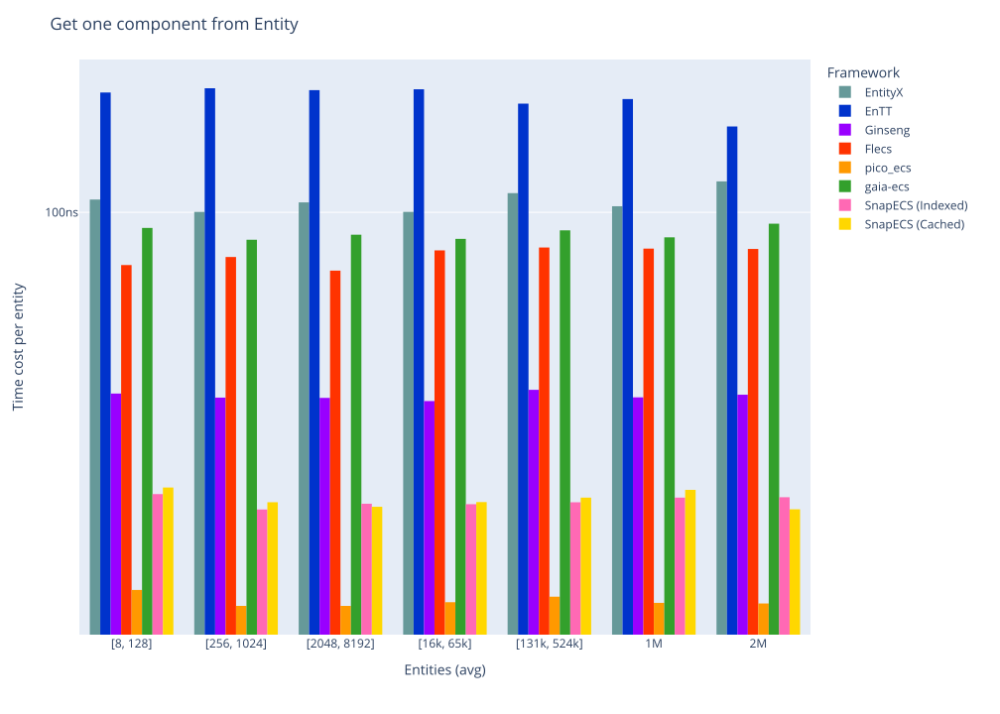

_Graph shows cost per entity, tables shows total cost. lower is faster._

|                                     | EntityX | EnTT    | Ginseng | Flecs  | pico_ecs | gaia-ecs | SnapECS (Indexed) | SnapECS (Cached) |
| :---------------------------------- | :------ | :------ | :------ | :----- | :------- | :------- | :---------------- | :--------------- |
| Unpack one component in 1 entities  | 106ns   | 219ns   | 40ns    | 77ns   | 15ns     | 93ns     | 25ns              | 25ns             |
| Unpack one component in 4 entities  | 526ns   | 815ns   | 160ns   | 305ns  | 50ns     | 364ns    | 83ns              | 89ns             |
| Unpack one component in 8 entities  | 793ns   | 1666ns  | 306ns   | 608ns  | 110ns    | 746ns    | 177ns             | 180ns            |
| Unpack one component in 16 entities | 1624ns  | 2744ns  | 578ns   | 1209ns | 204ns    | 1539ns   | 340ns             | 360ns            |
| Unpack one component in 32 entities | 3520ns  | 5569ns  | 1125ns  | 2375ns | 384ns    | 2961ns   | 682ns             | 766ns            |
| Unpack one component in 64 entities | 6493ns  | 10695ns | 2340ns  | 4452ns | 730ns    | 5716ns   | 1306ns            | 1349ns           |

|                                       | EntityX | EnTT   | Ginseng | Flecs  | pico_ecs | gaia-ecs | SnapECS (Indexed) | SnapECS (Cached) |
| :------------------------------------ | :------ | :----- | :------ | :----- | :------- | :------- | :---------------- | :--------------- |
| Unpack one component in 256 entities  | 24us    | 51us   | 9us     | 21us   | 3us      | 21us     | 5us               | 5us              |
| Unpack one component in ~1K entities  | 108us   | 192us  | 37us    | 74us   | 11us     | 88us     | 20us              | 21us             |
| Unpack one component in ~4K entities  | 431us   | 799us  | 155us   | 298us  | 49us     | 375us    | 84us              | 84us             |
| Unpack one component in ~16K entities | 1677us  | 3188us | 571us   | 1359us | 203us    | 1442us   | 343us             | 346us            |

|                                       | EntityX | EnTT  | Ginseng | Flecs | pico_ecs | gaia-ecs | SnapECS (Indexed) | SnapECS (Cached) |
| :------------------------------------ | :------ | :---- | :------ | :---- | :------- | :------- | :---------------- | :--------------- |
| Unpack one component in ~65K entities | 6ms     | 11ms  | 2ms     | 5ms   | 0ms      | 5ms      | 1ms               | 1ms              |
| Unpack one component in 262K entities | 30ms    | 41ms  | 9ms     | 18ms  | 3ms      | 24ms     | 5ms               | 5ms              |
| Unpack one component in ~1M entities  | 108ms   | 193ms | 38ms    | 86ms  | 12ms     | 91ms     | 22ms              | 23ms             |
| Unpack one component in ~2M entities  | 247ms   | 333ms | 78ms    | 172ms | 25ms     | 197ms    | 45ms              | 42ms             |

**Note:**

- Get one non-const component
  1.  `PositionComponent`

### Get two components from entity

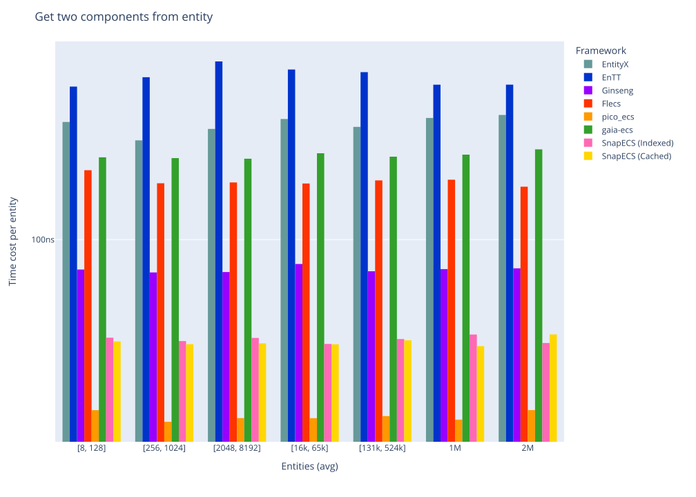

_Graph shows cost per entity, tables shows total cost. lower is faster._

|                                      | EntityX | EnTT    | Ginseng | Flecs   | pico_ecs | gaia-ecs | SnapECS (Indexed) | SnapECS (Cached) |
| :----------------------------------- | :------ | :------ | :------ | :------ | :------- | :------- | :---------------- | :--------------- |
| Unpack two components in 1 entities  | 228ns   | 317ns   | 85ns    | 186ns   | 31ns     | 192ns    | 55ns              | 50ns             |
| Unpack two components in 4 entities  | 1013ns  | 1280ns  | 334ns   | 688ns   | 107ns    | 748ns    | 195ns             | 182ns            |
| Unpack two components in 8 entities  | 2485ns  | 2456ns  | 626ns   | 1384ns  | 221ns    | 1453ns   | 365ns             | 383ns            |
| Unpack two components in 16 entities | 3848ns  | 4984ns  | 1222ns  | 2564ns  | 409ns    | 3039ns   | 719ns             | 711ns            |
| Unpack two components in 32 entities | 7308ns  | 10633ns | 2469ns  | 5184ns  | 868ns    | 5864ns   | 1428ns            | 1455ns           |
| Unpack two components in 64 entities | 14241ns | 21388ns | 5038ns  | 10790ns | 1636ns   | 12145ns  | 2962ns            | 2664ns           |

|                                        | EntityX | EnTT   | Ginseng | Flecs  | pico_ecs | gaia-ecs | SnapECS (Indexed) | SnapECS (Cached) |
| :------------------------------------- | :------ | :----- | :------ | :----- | :------- | :------- | :---------------- | :--------------- |
| Unpack two components in 256 entities  | 55us    | 80us   | 20us    | 38us   | 6us      | 46us     | 11us              | 11us             |
| Unpack two components in ~1K entities  | 217us   | 395us  | 79us    | 155us  | 24us     | 190us    | 46us              | 43us             |
| Unpack two components in ~4K entities  | 926us   | 1605us | 323us   | 648us  | 105us    | 789us    | 180us             | 180us            |
| Unpack two components in ~16K entities | 4004us  | 5922us | 1306us  | 2443us | 431us    | 3155us   | 779us             | 736us            |

|                                        | EntityX | EnTT  | Ginseng | Flecs | pico_ecs | gaia-ecs | SnapECS (Indexed) | SnapECS (Cached) |
| :------------------------------------- | :------ | :---- | :------ | :---- | :------- | :------- | :---------------- | :--------------- |
| Unpack two components in ~65K entities | 17ms    | 22ms  | 5ms     | 10ms  | 1ms      | 13ms     | 2ms               | 2ms              |
| Unpack two components in 262K entities | 57ms    | 99ms  | 20ms    | 43ms  | 6ms      | 51ms     | 12ms              | 12ms             |
| Unpack two components in ~1M entities  | 265ms   | 342ms | 83ms    | 165ms | 26ms     | 200ms    | 50ms              | 46ms             |
| Unpack two components in ~2M entities  | 542ms   | 684ms | 168ms   | 314ms | 57ms     | 417ms    | 95ms              | 101ms            |

**Note:**

- Get non-const- and const-component
  1.  `PositionComponent`
  2.  `const VelocityComponent`

### Get three components from entity

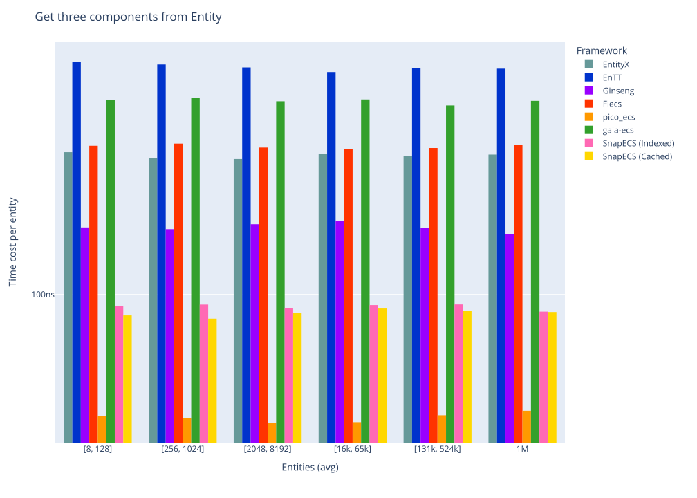

_Graph shows cost per entity, tables shows total cost. lower is faster._

|                                         | EntityX | EnTT    | Ginseng | Flecs   | pico_ecs | gaia-ecs | SnapECS (Indexed) | SnapECS (Cached) |
| :-------------------------------------- | :------ | :------ | :------ | :------ | :------- | :------- | :---------------- | :--------------- |
| Unpack three components in 1 entities   | 257ns   | 551ns   | 171ns   | 289ns   | 43ns     | 423ns    | 94ns              | 83ns             |
| Unpack three components in 2 entities   | 544ns   | 1067ns  | 333ns   | 588ns   | 84ns     | 765ns    | 186ns             | 175ns            |
| Unpack three components in 8 entities   | 2074ns  | 4024ns  | 1191ns  | 2236ns  | 352ns    | 3142ns   | 744ns             | 699ns            |
| Unpack three components in 16 entities  | 4496ns  | 8360ns  | 2512ns  | 4611ns  | 665ns    | 6765ns   | 1400ns            | 1354ns           |
| Unpack three components in 32 entities  | 8384ns  | 16771ns | 5159ns  | 9081ns  | 1286ns   | 12477ns  | 2968ns            | 2873ns           |
| Unpack three components in 64 entities  | 16764ns | 31902ns | 10582ns | 17454ns | 2572ns   | 25676ns  | 5687ns            | 5336ns           |
| Unpack three components in 128 entities | 33386ns | 62208ns | 20626ns | 36306ns | 5134ns   | 50389ns  | 11536ns           | 10853ns          |

|                                         | EntityX | EnTT   | Ginseng | Flecs  | pico_ecs | gaia-ecs | SnapECS (Indexed) | SnapECS (Cached) |
| :-------------------------------------- | :------ | :----- | :------ | :----- | :------- | :------- | :---------------- | :--------------- |
| Unpack three components in 512 entities | 138us   | 249us  | 82us    | 151us  | 20us     | 219us    | 47us              | 43us             |
| Unpack three components in ~2K entities | 550us   | 1022us | 338us   | 578us  | 81us     | 823us    | 180us             | 181us            |
| Unpack three components in ~8K entities | 2100us  | 4116us | 1362us  | 2224us | 333us    | 3143us   | 764us             | 717us            |

|                                          | EntityX | EnTT  | Ginseng | Flecs | pico_ecs | gaia-ecs | SnapECS (Indexed) | SnapECS (Cached) |
| :--------------------------------------- | :------ | :---- | :------ | :---- | :------- | :------- | :---------------- | :--------------- |
| Unpack three components in ~32K entities | 9ms     | 15ms  | 5ms     | 9ms   | 1ms      | 12ms     | 2ms               | 2ms              |
| Unpack three components in 131K entities | 35ms    | 64ms  | 23ms    | 39ms  | 5ms      | 51ms     | 12ms              | 12ms             |
| Unpack three components in 524K entities | 136ms   | 259ms | 78ms    | 133ms | 21ms     | 198ms    | 47ms              | 45ms             |
| Unpack three components in ~1M entities  | 283ms   | 521ms | 161ms   | 302ms | 45ms     | 415ms    | 92ms              | 92ms             |

**Note:**

- Not every entity has three components, some has only two
- Get two non-const- and const-component(s)
  1.  `PositionComponent`
  2.  `const VelocityComponent`
  3.  `DataComponent` (optional)

### Remove and add component

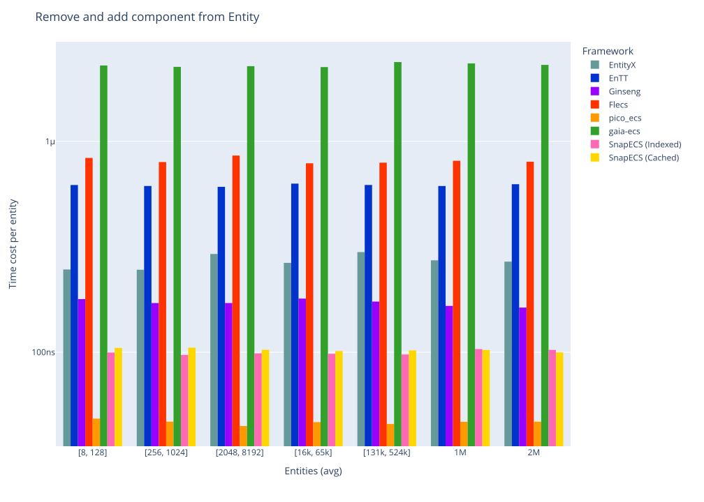

_Graph shows cost per entity, tables shows total cost. lower is faster._

|                                           | EntityX | EnTT    | Ginseng | Flecs   | pico_ecs | gaia-ecs | SnapECS (Indexed) | SnapECS (Cached) |
| :---------------------------------------- | :------ | :------ | :------ | :------ | :------- | :------- | :---------------- | :--------------- |
| Remove and Add a Component in 1 entities  | 242ns   | 624ns   | 186ns   | 874ns   | 55ns     | 2281ns   | 92ns              | 96ns             |
| Remove and Add a Component in 4 entities  | 1000ns  | 2586ns  | 726ns   | 3416ns  | 189ns    | 9869ns   | 394ns             | 446ns            |
| Remove and Add a Component in 8 entities  | 1900ns  | 5027ns  | 1357ns  | 6564ns  | 381ns    | 18781ns  | 824ns             | 834ns            |
| Remove and Add a Component in 16 entities | 3863ns  | 10240ns | 2726ns  | 13240ns | 792ns    | 34643ns  | 1536ns            | 1656ns           |
| Remove and Add a Component in 32 entities | 7695ns  | 18717ns | 5727ns  | 24832ns | 1536ns   | 71472ns  | 3284ns            | 3410ns           |
| Remove and Add a Component in 64 entities | 17462ns | 39558ns | 10887ns | 53094ns | 2944ns   | 137598ns | 6398ns            | 6598ns           |

|                                             | EntityX | EnTT    | Ginseng | Flecs   | pico_ecs | gaia-ecs | SnapECS (Indexed) | SnapECS (Cached) |
| :------------------------------------------ | :------ | :------ | :------ | :------ | :------- | :------- | :---------------- | :--------------- |
| Remove and Add a Component in 256 entities  | 61us    | 157us   | 44us    | 203us   | 11us     | 578us    | 24us              | 27us             |
| Remove and Add a Component in ~1K entities  | 268us   | 630us   | 177us   | 841us   | 48us     | 2332us   | 100us             | 104us            |
| Remove and Add a Component in ~4K entities  | 1203us  | 2475us  | 710us   | 3593us  | 191us    | 9442us   | 397us             | 414us            |
| Remove and Add a Component in ~16K entities | 4119us  | 10099us | 2988us  | 13135us | 753us    | 37146us  | 1600us            | 1621us           |

|                                             | EntityX | EnTT   | Ginseng | Flecs  | pico_ecs | gaia-ecs | SnapECS (Indexed) | SnapECS (Cached) |
| :------------------------------------------ | :------ | :----- | :------ | :----- | :------- | :------- | :---------------- | :--------------- |
| Remove and Add a Component in ~65K entities | 17ms    | 42ms   | 11ms    | 52ms   | 3ms      | 151ms    | 6ms               | 6ms              |
| Remove and Add a Component in 262K entities | 68ms    | 164ms  | 46ms    | 196ms  | 12ms     | 617ms    | 25ms              | 25ms             |
| Remove and Add a Component in ~1M entities  | 286ms   | 643ms  | 173ms   | 848ms  | 49ms     | 2456ms   | 108ms             | 107ms            |
| Remove and Add a Component in ~2M entities  | 563ms   | 1313ms | 341ms   | 1679ms | 98ms     | 4832ms   | 215ms             | 209ms            |

**Note:**

- Remove and add `PositionComponent`

### Steady update (for-each entities in 2 systems)

|               Cost per entity                |                 Cost of all entities                  |
| :------------------------------------------: | :---------------------------------------------------: |
| 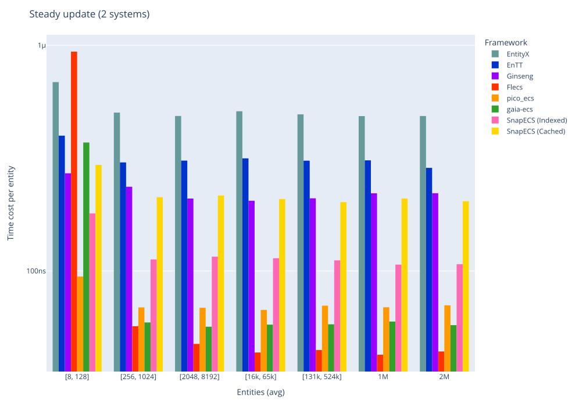 | 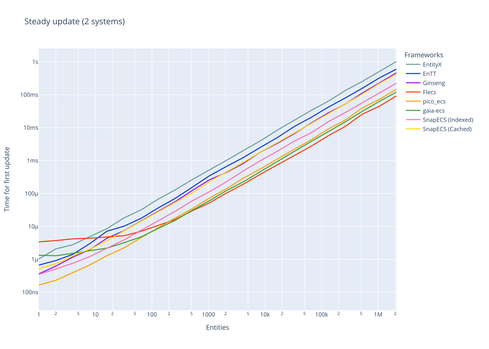 |

_Tables shows total cost. lower is faster._

|                                          | EntityX | EnTT    | Ginseng | Flecs  | pico_ecs | gaia-ecs | SnapECS (Indexed) | SnapECS (Cached) |
| :--------------------------------------- | :------ | :------ | :------ | :----- | :------- | :------- | :---------------- | :--------------- |
| Steady update 1 entities with 2 systems  | 1026ns  | 668ns   | 362ns   | 3387ns | 165ns    | 1330ns   | 349ns             | 526ns            |
| Steady update 4 entities with 2 systems  | 2784ns  | 1424ns  | 1172ns  | 4191ns | 394ns    | 1538ns   | 761ns             | 1276ns           |
| Steady update 8 entities with 2 systems  | 4914ns  | 3014ns  | 1981ns  | 4381ns | 678ns    | 1842ns   | 1217ns            | 2039ns           |
| Steady update 16 entities with 2 systems | 8587ns  | 7152ns  | 4353ns  | 4716ns | 1286ns   | 2185ns   | 2180ns            | 3656ns           |
| Steady update 32 entities with 2 systems | 18090ns | 10140ns | 7425ns  | 5198ns | 2223ns   | 3185ns   | 3873ns            | 7357ns           |
| Steady update 64 entities with 2 systems | 31637ns | 17513ns | 14531ns | 7109ns | 4538ns   | 4792ns   | 7604ns            | 14258ns          |

|                                            | EntityX | EnTT   | Ginseng | Flecs | pico_ecs | gaia-ecs | SnapECS (Indexed) | SnapECS (Cached) |
| :----------------------------------------- | :------ | :----- | :------ | :---- | :------- | :------- | :---------------- | :--------------- |
| Steady update 256 entities with 2 systems  | 128us   | 70us   | 55us    | 16us  | 17us     | 15us     | 28us              | 54us             |
| Steady update ~1K entities with 2 systems  | 508us   | 339us  | 257us   | 51us  | 71us     | 59us     | 111us             | 228us            |
| Steady update ~4K entities with 2 systems  | 1995us  | 1226us | 814us   | 190us | 290us    | 225us    | 480us             | 876us            |
| Steady update ~16K entities with 2 systems | 8367us  | 4961us | 3317us  | 739us | 1123us   | 944us    | 1908us            | 3471us           |

|                                            | EntityX | EnTT  | Ginseng | Flecs | pico_ecs | gaia-ecs | SnapECS (Indexed) | SnapECS (Cached) |
| :----------------------------------------- | :------ | :---- | :------ | :---- | :------- | :------- | :---------------- | :--------------- |
| Steady update ~65K entities with 2 systems | 33ms    | 20ms  | 13ms    | 2ms   | 4ms      | 3ms      | 6ms               | 13ms             |
| Steady update 262K entities with 2 systems | 134ms   | 79ms  | 52ms    | 10ms  | 17ms     | 14ms     | 28ms              | 53ms             |
| Steady update ~1M entities with 2 systems  | 508ms   | 324ms | 231ms   | 44ms  | 72ms     | 62ms     | 111ms             | 219ms            |
| Steady update ~2M entities with 2 systems  | 1018ms  | 600ms | 463ms   | 92ms  | 147ms    | 120ms    | 224ms             | 427ms            |

**Note:**

- Systems used
  1. `MovementSystem`
  2. `DataSystem`

### Steady update (for-each entities (with mixed components) in 2 systems)

|                            Cost per entity                             |                              Cost of all entities                               |
| :--------------------------------------------------------------------: | :-----------------------------------------------------------------------------: |
| 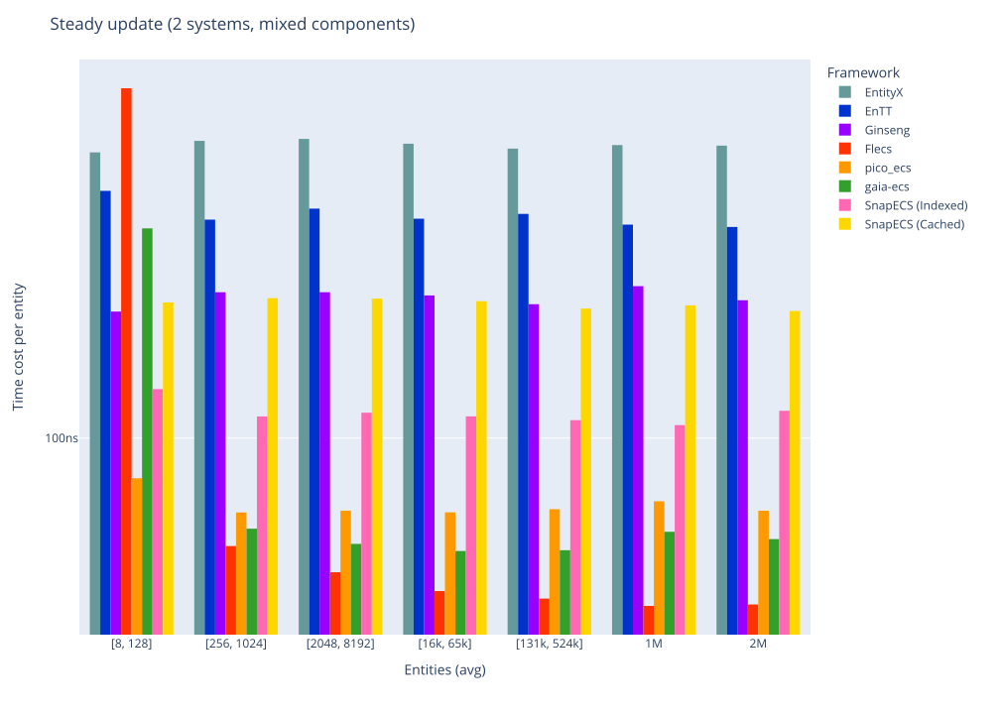 | 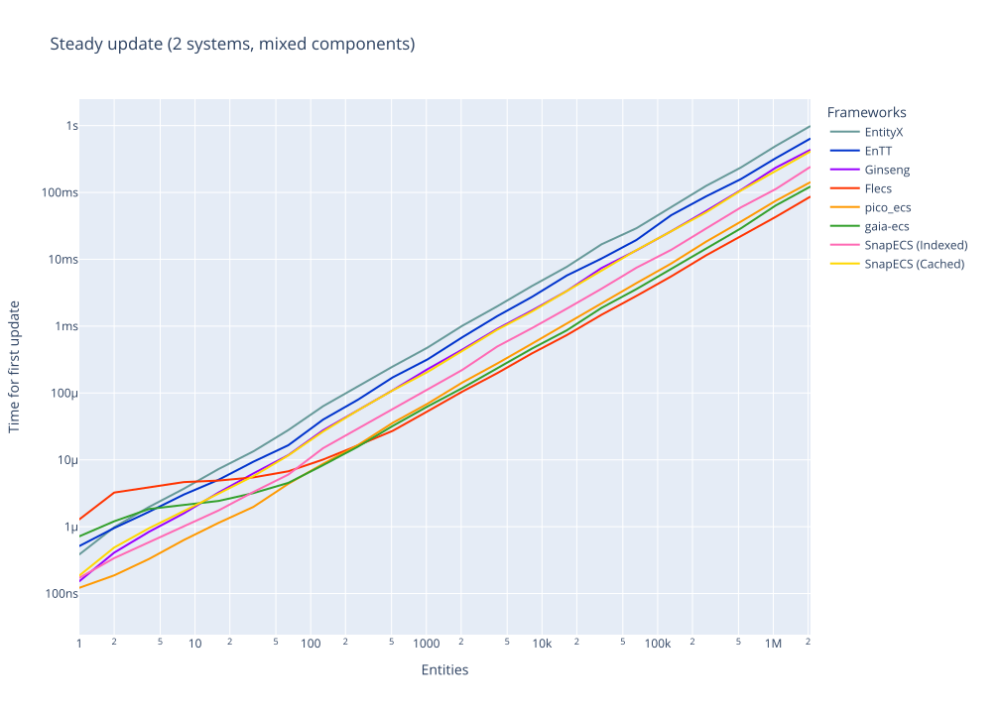 |

_Tables shows total cost. lower is faster._

|                                          | EntityX | EnTT    | Ginseng | Flecs  | pico_ecs | gaia-ecs | SnapECS (Indexed) | SnapECS (Cached) |
| :--------------------------------------- | :------ | :------ | :------ | :----- | :------- | :------- | :---------------- | :--------------- |
| Steady update 1 entities with 2 systems  | 385ns   | 514ns   | 153ns   | 1288ns | 122ns    | 718ns    | 172ns             | 186ns            |
| Steady update 4 entities with 2 systems  | 1973ns  | 1671ns  | 839ns   | 3842ns | 329ns    | 1840ns   | 584ns             | 948ns            |
| Steady update 8 entities with 2 systems  | 3695ns  | 3024ns  | 1585ns  | 4646ns | 632ns    | 2115ns   | 1007ns            | 1715ns           |
| Steady update 16 entities with 2 systems | 7296ns  | 5038ns  | 3248ns  | 4898ns | 1143ns   | 2429ns   | 1752ns            | 3093ns           |
| Steady update 32 entities with 2 systems | 13418ns | 9395ns  | 6268ns  | 5466ns | 1980ns   | 3182ns   | 3314ns            | 5716ns           |
| Steady update 64 entities with 2 systems | 27856ns | 16531ns | 11767ns | 6740ns | 4377ns   | 4522ns   | 6012ns            | 11634ns          |

|                                            | EntityX | EnTT   | Ginseng | Flecs | pico_ecs | gaia-ecs | SnapECS (Indexed) | SnapECS (Cached) |
| :----------------------------------------- | :------ | :----- | :------ | :---- | :------- | :------- | :---------------- | :--------------- |
| Steady update 256 entities with 2 systems  | 127us   | 79us   | 54us    | 16us  | 16us     | 15us     | 29us              | 55us             |
| Steady update ~1K entities with 2 systems  | 477us   | 318us  | 226us   | 53us  | 69us     | 62us     | 112us             | 206us            |
| Steady update ~4K entities with 2 systems  | 1978us  | 1410us | 911us   | 197us | 275us    | 233us    | 495us             | 883us            |
| Steady update ~16K entities with 2 systems | 7719us  | 5721us | 3357us  | 735us | 1092us   | 866us    | 1827us            | 3321us           |

|                                            | EntityX | EnTT  | Ginseng | Flecs | pico_ecs | gaia-ecs | SnapECS (Indexed) | SnapECS (Cached) |
| :----------------------------------------- | :------ | :---- | :------ | :---- | :------- | :------- | :---------------- | :--------------- |
| Steady update ~65K entities with 2 systems | 29ms    | 19ms  | 13ms    | 2ms   | 4ms      | 3ms      | 7ms               | 13ms             |
| Steady update 262K entities with 2 systems | 125ms   | 87ms  | 52ms    | 11ms  | 18ms     | 14ms     | 28ms              | 50ms             |
| Steady update ~1M entities with 2 systems  | 495ms   | 325ms | 234ms   | 43ms  | 75ms     | 63ms     | 112ms             | 211ms            |
| Steady update ~2M entities with 2 systems  | 988ms   | 642ms | 435ms   | 86ms  | 142ms    | 122ms    | 242ms             | 411ms            |

**Note:**

- Systems used
  1. `MovementSystem`
  2. `DataSystem`
- Not every entity has all three components, some got removed

### First update (cold view build: one system-logic pass, 2 systems)

|                    Cost per entity                     |                      Cost of all entities                       |
| :----------------------------------------------------: | :-------------------------------------------------------------: |
| 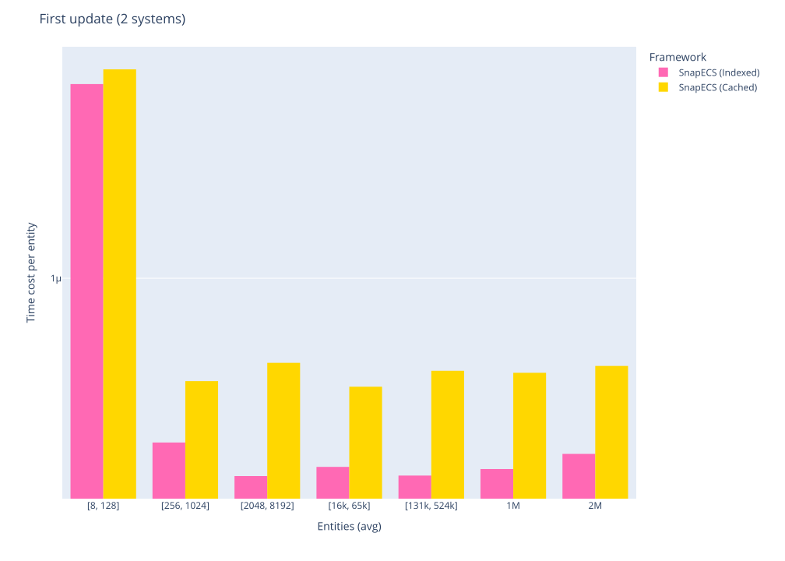 | 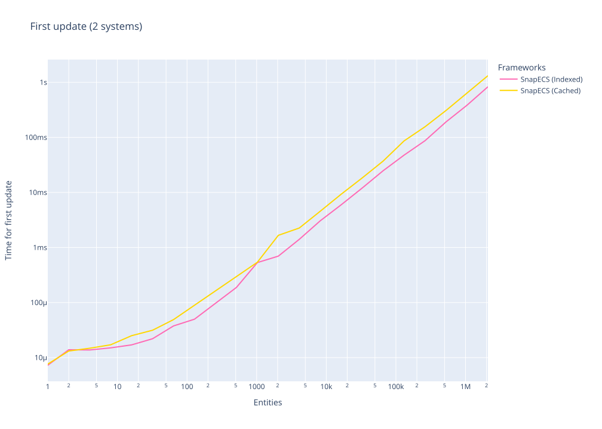 |

_Tables shows total cost. lower is faster._

|                                         | SnapECS (Indexed) | SnapECS (Cached) |
| :-------------------------------------- | :---------------- | :--------------- |
| First update 1 entities with 2 systems  | 7266ns            | 7633ns           |
| First update 4 entities with 2 systems  | 13766ns           | 14799ns          |
| First update 8 entities with 2 systems  | 15033ns           | 17100ns          |
| First update 16 entities with 2 systems | 17033ns           | 25033ns          |
| First update 32 entities with 2 systems | 22033ns           | 31433ns          |
| First update 64 entities with 2 systems | 37633ns           | 49033ns          |

|                                           | SnapECS (Indexed) | SnapECS (Cached) |
| :---------------------------------------- | :---------------- | :--------------- |
| First update 256 entities with 2 systems  | 95us              | 162us            |
| First update ~1K entities with 2 systems  | 532us             | 540us            |
| First update ~4K entities with 2 systems  | 1407us            | 2259us           |
| First update ~16K entities with 2 systems | 5971us            | 9296us           |

|                                           | SnapECS (Indexed) | SnapECS (Cached) |
| :---------------------------------------- | :---------------- | :--------------- |
| First update ~65K entities with 2 systems | 24ms              | 37ms             |
| First update 262K entities with 2 systems | 87ms              | 156ms            |
| First update ~1M entities with 2 systems  | 383ms             | 636ms            |
| First update ~2M entities with 2 systems  | 830ms             | 1320ms           |

### First update (cold view build: one system-logic pass, mixed components, 2 systems)

|                                 Cost per entity                                  |                                   Cost of all entities                                    |
| :------------------------------------------------------------------------------: | :---------------------------------------------------------------------------------------: |
| 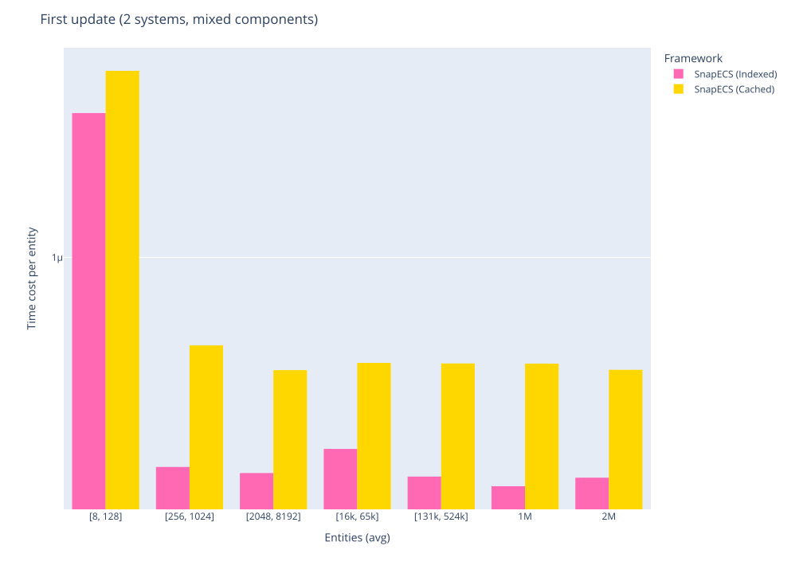 | 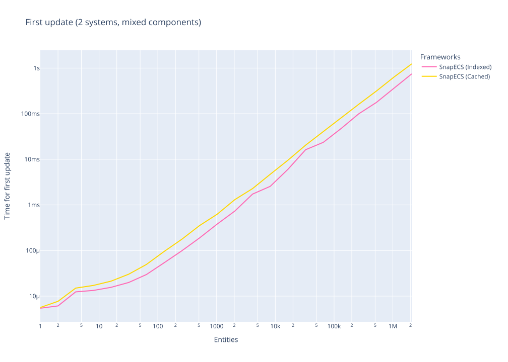 |

_Tables shows total cost. lower is faster._

|                                               | SnapECS (Indexed) | SnapECS (Cached) |
| :-------------------------------------------- | :---------------- | :--------------- |
| First update 1 mixed entities with 2 systems  | 5433ns            | 5633ns           |
| First update 4 mixed entities with 2 systems  | 12400ns           | 14999ns          |
| First update 8 mixed entities with 2 systems  | 13333ns           | 17166ns          |
| First update 16 mixed entities with 2 systems | 15600ns           | 21300ns          |
| First update 32 mixed entities with 2 systems | 19933ns           | 30299ns          |
| First update 64 mixed entities with 2 systems | 29766ns           | 49533ns          |

|                                                 | SnapECS (Indexed) | SnapECS (Cached) |
| :---------------------------------------------- | :---------------- | :--------------- |
| First update 256 mixed entities with 2 systems  | 98us              | 176us            |
| First update ~1K mixed entities with 2 systems  | 380us             | 625us            |
| First update ~4K mixed entities with 2 systems  | 1726us            | 2281us           |
| First update ~16K mixed entities with 2 systems | 6032us            | 9550us           |

|                                                 | SnapECS (Indexed) | SnapECS (Cached) |
| :---------------------------------------------- | :---------------- | :--------------- |
| First update ~65K mixed entities with 2 systems | 23ms              | 40ms             |
| First update 262K mixed entities with 2 systems | 99ms              | 160ms            |
| First update ~1M mixed entities with 2 systems  | 358ms             | 637ms            |
| First update ~2M mixed entities with 2 systems  | 747ms             | 1238ms           |

### Steady update (for-each entities in 7 systems)

|                      Cost per entity                       |                        Cost of all entities                         |
| :--------------------------------------------------------: | :-----------------------------------------------------------------: |
| 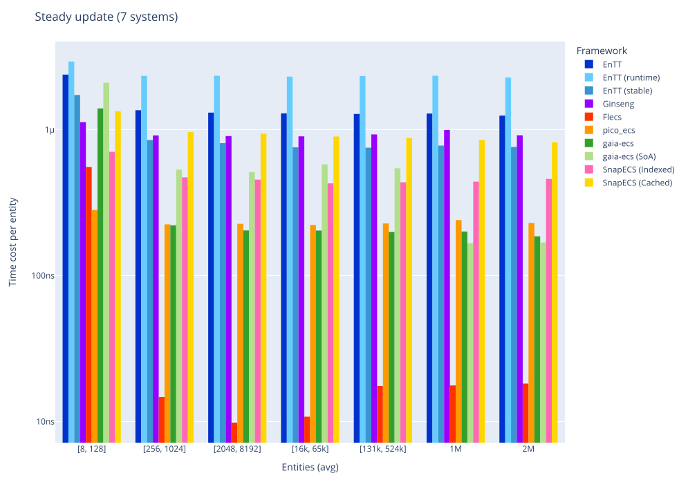 | 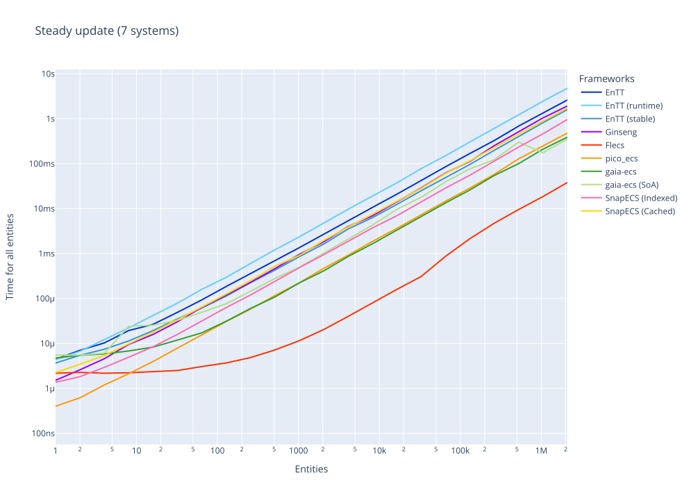 |

_Tables shows total cost. lower is faster._

|                                          | EnTT    | EnTT (runtime) | EnTT (stable) | Ginseng | Flecs  | pico_ecs | gaia-ecs | gaia-ecs (SoA) | SnapECS (Indexed) | SnapECS (Cached) |
| :--------------------------------------- | :------ | :------------- | :------------ | :------ | :----- | :------- | :------- | :------------- | :---------------- | :--------------- |
| Steady update 1 entities with 7 systems  | 4452ns  | 4345ns         | 3668ns        | 1513ns  | 2176ns | 401ns    | 4740ns   | 5535ns         | 1366ns            | 2250ns           |
| Steady update 4 entities with 7 systems  | 10259ns | 12198ns        | 7435ns        | 4571ns  | 2176ns | 1194ns   | 5844ns   | 6075ns         | 2941ns            | 5418ns           |
| Steady update 8 entities with 7 systems  | 19371ns | 22267ns        | 11379ns       | 9516ns  | 2229ns | 2120ns   | 6802ns   | 23910ns        | 4930ns            | 9775ns           |
| Steady update 16 entities with 7 systems | 26613ns | 41892ns        | 19330ns       | 15868ns | 2370ns | 3968ns   | 8295ns   | 25576ns        | 8469ns            | 17823ns          |
| Steady update 32 entities with 7 systems | 49219ns | 78817ns        | 35145ns       | 30363ns | 2502ns | 7868ns   | 11917ns  | 32642ns        | 15901ns           | 33544ns          |
| Steady update 64 entities with 7 systems | 93183ns | 159594ns       | 61373ns       | 63392ns | 3066ns | 15640ns  | 17242ns  | 49443ns        | 31675ns           | 63997ns          |

|                                            | EnTT    | EnTT (runtime) | EnTT (stable) | Ginseng | Flecs | pico_ecs | gaia-ecs | gaia-ecs (SoA) | SnapECS (Indexed) | SnapECS (Cached) |
| :----------------------------------------- | :------ | :------------- | :------------ | :------ | :---- | :------- | :------- | :------------- | :---------------- | :--------------- |
| Steady update 256 entities with 7 systems  | 357us   | 601us          | 224us         | 230us   | 4us   | 58us     | 60us     | 144us          | 119us             | 250us            |
| Steady update ~1K entities with 7 systems  | 1351us  | 2350us         | 851us         | 959us   | 11us  | 223us    | 222us    | 495us          | 485us             | 909us            |
| Steady update ~4K entities with 7 systems  | 5394us  | 9651us         | 3511us        | 3979us  | 39us  | 916us    | 858us    | 2115us         | 1851us            | 3861us           |
| Steady update ~16K entities with 7 systems | 20892us | 37247us        | 12368us       | 14272us | 159us | 3626us   | 3338us   | 9634us         | 6938us            | 14847us          |

|                                            | EnTT   | EnTT (runtime) | EnTT (stable) | Ginseng | Flecs | pico_ecs | gaia-ecs | gaia-ecs (SoA) | SnapECS (Indexed) | SnapECS (Cached) |
| :----------------------------------------- | :----- | :------------- | :------------ | :------ | :---- | :------- | :------- | :------------- | :---------------- | :--------------- |
| Steady update ~65K entities with 7 systems | 85ms   | 150ms          | 49ms          | 61ms    | 0ms   | 14ms     | 13ms     | 39ms           | 28ms              | 60ms             |
| Steady update 262K entities with 7 systems | 327ms  | 611ms          | 198ms         | 251ms   | 4ms   | 57ms     | 54ms     | 122ms          | 114ms             | 229ms            |
| Steady update ~1M entities with 7 systems  | 1351ms | 2454ms         | 815ms         | 1043ms  | 18ms  | 251ms    | 210ms    | 174ms          | 461ms             | 891ms            |
| Steady update ~2M entities with 7 systems  | 2617ms | 4778ms         | 1596ms        | 1918ms  | 38ms  | 481ms    | 389ms    | 353ms          | 963ms             | 1719ms           |

**Note:**

- Systems used
  1. `MovementSystem`
  2. `DataSystem`
  3. `MoreComplexSystem`
  4. `HealthSystem`
  5. `DamageSystem`
  6. `SpriteSystem`
  7. `RenderSystem`
- \* EnTT iterate components via [views](https://github.com/skypjack/entt/wiki/Crash-Course:-entity-component-system#views=)
- \*\* EnTT iterate components via [runtime views](https://github.com/skypjack/entt/wiki/Crash-Course:-entity-component-system#runtime-views=)
- \*\*\* EnTT iterate components via [groups](https://github.com/skypjack/entt/wiki/Crash-Course:-entity-component-system#groups=):
  1.  `DataSystem`: No Group, use `registry.view<DataComponent>`. _(Can't group a single component)_
  2.  `MovementSystem`: Partial-owning group, `registry.group<PositionComponent>(entt::get<const VelocityComponent>)`
  3.  `MoreComplexSystem`: Full-owning group, `registry.group<PositionComponent, VelocityComponent, DataComponent>()`
- \*\*\*\* EnTT iterate components via view and uses a [stable component](https://github.com/skypjack/entt/wiki/Crash-Course:-entity-component-system#pointer-stability=) (`StablePositionComponent`)
- \*\*\*\*\* gaia-ecs (SoA) iterate via [SoA Layout](https://github.com/richardbiely/gaia-ecs?tab=readme-ov-file#data-layouts) using an `Position`- and `Velocity`-SoA-component

### First update (one system-logic pass, 7 systems)

|                           Cost per entity                            |                             Cost of all entities                              |
| :------------------------------------------------------------------: | :---------------------------------------------------------------------------: |
| 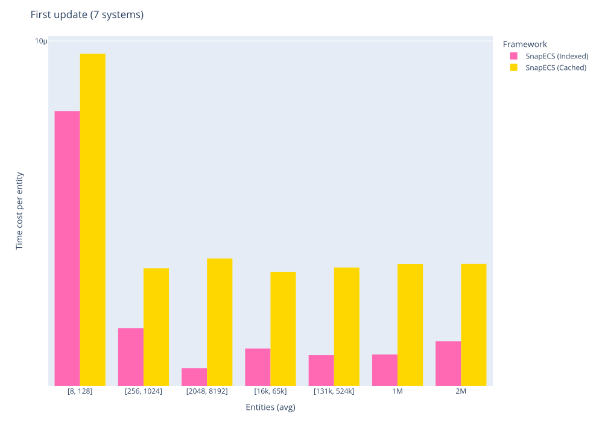 | 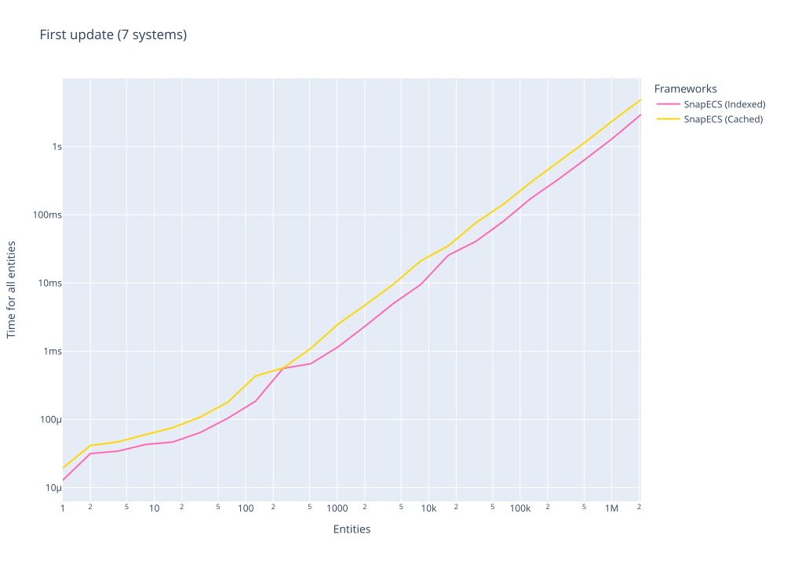 |

_Tables shows total cost. lower is faster._

|                                         | SnapECS (Indexed) | SnapECS (Cached) |
| :-------------------------------------- | :---------------- | :--------------- |
| First update 1 entities with 7 systems  | 12866ns           | 19399ns          |
| First update 4 entities with 7 systems  | 34266ns           | 46866ns          |
| First update 8 entities with 7 systems  | 42866ns           | 59899ns          |
| First update 16 entities with 7 systems | 46666ns           | 75833ns          |
| First update 32 entities with 7 systems | 64566ns           | 108600ns         |
| First update 64 entities with 7 systems | 104666ns          | 180033ns         |

|                                           | SnapECS (Indexed) | SnapECS (Cached) |
| :---------------------------------------- | :---------------- | :--------------- |
| First update 256 entities with 7 systems  | 559us             | 567us            |
| First update ~1K entities with 7 systems  | 1160us            | 2498us           |
| First update ~4K entities with 7 systems  | 4986us            | 9537us           |
| First update ~16K entities with 7 systems | 25518us           | 34992us          |

|                                           | SnapECS (Indexed) | SnapECS (Cached) |
| :---------------------------------------- | :---------------- | :--------------- |
| First update ~65K entities with 7 systems | 80ms              | 142ms            |
| First update 262K entities with 7 systems | 331ms             | 598ms            |
| First update ~1M entities with 7 systems  | 1352ms            | 2442ms           |
| First update ~2M entities with 7 systems  | 2948ms            | 4888ms           |

### Steady update (for-each entities (with mixed components) in 7 systems)

|                                   Cost per entity                                    |                                     Cost of all entities                                      |
| :----------------------------------------------------------------------------------: | :-------------------------------------------------------------------------------------------: |
|  | 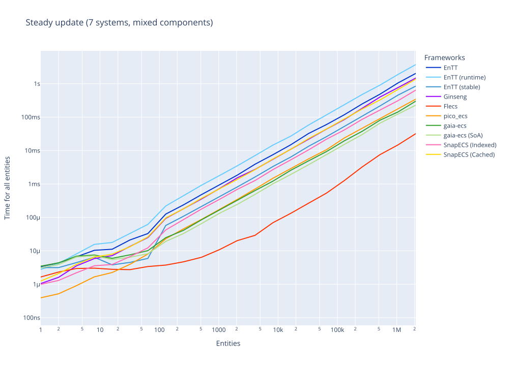 |

_Tables shows total cost. lower is faster._

|                                          | EnTT    | EnTT (runtime) | EnTT (stable) | Ginseng | Flecs  | pico_ecs | gaia-ecs | gaia-ecs (SoA) | SnapECS (Indexed) | SnapECS (Cached) |
| :--------------------------------------- | :------ | :------------- | :------------ | :------ | :----- | :------- | :------- | :------------- | :---------------- | :--------------- |
| Steady update 1 entities with 7 systems  | 3367ns  | 2774ns         | 3142ns        | 1049ns  | 1651ns | 394ns    | 3477ns   | 3096ns         | 994ns             | 1249ns           |
| Steady update 4 entities with 7 systems  | 6618ns  | 8015ns         | 4444ns        | 3552ns  | 2964ns | 909ns    | 6928ns   | 6563ns         | 2206ns            | 3925ns           |
| Steady update 8 entities with 7 systems  | 10365ns | 15604ns        | 6426ns        | 5864ns  | 3033ns | 1665ns   | 7503ns   | 7151ns         | 3568ns            | 6519ns           |
| Steady update 16 entities with 7 systems | 11174ns | 17828ns        | 3809ns        | 7190ns  | 2800ns | 2247ns   | 5972ns   | 5490ns         | 3904ns            | 7952ns           |
| Steady update 32 entities with 7 systems | 21201ns | 32908ns        | 4518ns        | 13586ns | 2740ns | 3956ns   | 7599ns   | 6443ns         | 6739ns            | 13289ns          |
| Steady update 64 entities with 7 systems | 32921ns | 62020ns        | 5941ns        | 25054ns | 3392ns | 8032ns   | 10139ns  | 8203ns         | 12280ns           | 26056ns          |

|                                            | EnTT    | EnTT (runtime) | EnTT (stable) | Ginseng | Flecs | pico_ecs | gaia-ecs | gaia-ecs (SoA) | SnapECS (Indexed) | SnapECS (Cached) |
| :----------------------------------------- | :------ | :------------- | :------------ | :------ | :---- | :------- | :------- | :------------- | :---------------- | :--------------- |
| Steady update 256 entities with 7 systems  | 238us   | 450us          | 108us         | 184us   | 4us   | 45us     | 41us     | 33us           | 85us              | 181us            |
| Steady update ~1K entities with 7 systems  | 949us   | 1779us         | 416us         | 726us   | 10us  | 173us    | 167us    | 132us          | 345us             | 710us            |
| Steady update ~4K entities with 7 systems  | 3907us  | 7091us         | 1616us        | 2735us  | 29us  | 706us    | 636us    | 488us          | 1271us            | 2683us           |
| Steady update ~16K entities with 7 systems | 14911us | 27037us        | 6415us        | 11063us | 132us | 2895us   | 2569us   | 1925us         | 5274us            | 10910us          |

|                                            | EnTT   | EnTT (runtime) | EnTT (stable) | Ginseng | Flecs | pico_ecs | gaia-ecs | gaia-ecs (SoA) | SnapECS (Indexed) | SnapECS (Cached) |
| :----------------------------------------- | :----- | :------------- | :------------ | :------ | :---- | :------- | :------- | :------------- | :---------------- | :--------------- |
| Steady update ~65K entities with 7 systems | 60ms   | 116ms          | 26ms          | 43ms    | 0ms   | 10ms     | 9ms      | 7ms            | 21ms              | 44ms             |
| Steady update 262K entities with 7 systems | 249ms  | 476ms          | 106ms         | 183ms   | 3ms   | 46ms     | 37ms     | 30ms           | 86ms              | 175ms            |
| Steady update ~1M entities with 7 systems  | 1052ms | 1890ms         | 455ms         | 763ms   | 14ms  | 173ms    | 142ms    | 123ms          | 310ms             | 677ms            |
| Steady update ~2M entities with 7 systems  | 2040ms | 3743ms         | 850ms         | 1479ms  | 32ms  | 345ms    | 301ms    | 228ms          | 644ms             | 1377ms           |

**Note:**

- Systems used
  1. `MovementSystem`
  2. `DataSystem`
  3. `MoreComplexSystem`
  4. `HealthSystem`
  5. `DamageSystem`
  6. `SpriteSystem`
  7. `RenderSystem`
- Not every entity has all three components, some got removed
- \* EnTT iterate components via [views](https://github.com/skypjack/entt/wiki/Crash-Course:-entity-component-system#views=)
- \*\* EnTT iterate components via [runtime views](https://github.com/skypjack/entt/wiki/Crash-Course:-entity-component-system#runtime-views=)
- \*\*\* EnTT iterate components via [groups](https://github.com/skypjack/entt/wiki/Crash-Course:-entity-component-system#groups=):
  1. `DataSystem`: No Group, use `registry.view<DataComponent>`. _(Can't group a single component)_
  2. `MovementSystem`: Partial-owning group, `registry.group<PositionComponent>(entt::get<const VelocityComponent>)`
  3. `MoreComplexSystem`: Full-owning group, `registry.group<PositionComponent, VelocityComponent, DataComponent>()`
- \*\*\*\* EnTT iterate components via view and uses a [stable component](https://github.com/skypjack/entt/wiki/Crash-Course:-entity-component-system#pointer-stability=) (`StablePositionComponent`)
- \*\*\*\*\* gaia-ecs (SoA) iterate via [SoA Layout](https://github.com/richardbiely/gaia-ecs?tab=readme-ov-file#data-layouts) using an `Position`- und `Velocity`-SoA-component

### First update (one system-logic pass, mixed components, 7 systems)

|                                        Cost per entity                                         |                                          Cost of all entities                                           |
| :--------------------------------------------------------------------------------------------: | :-----------------------------------------------------------------------------------------------------: |
| 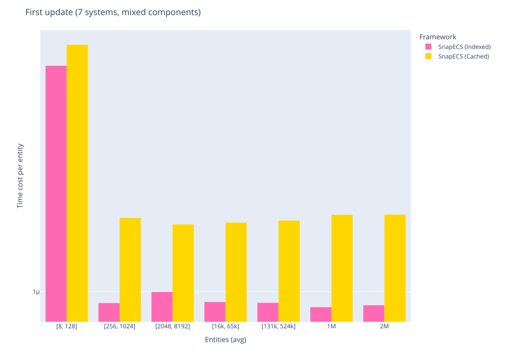 | 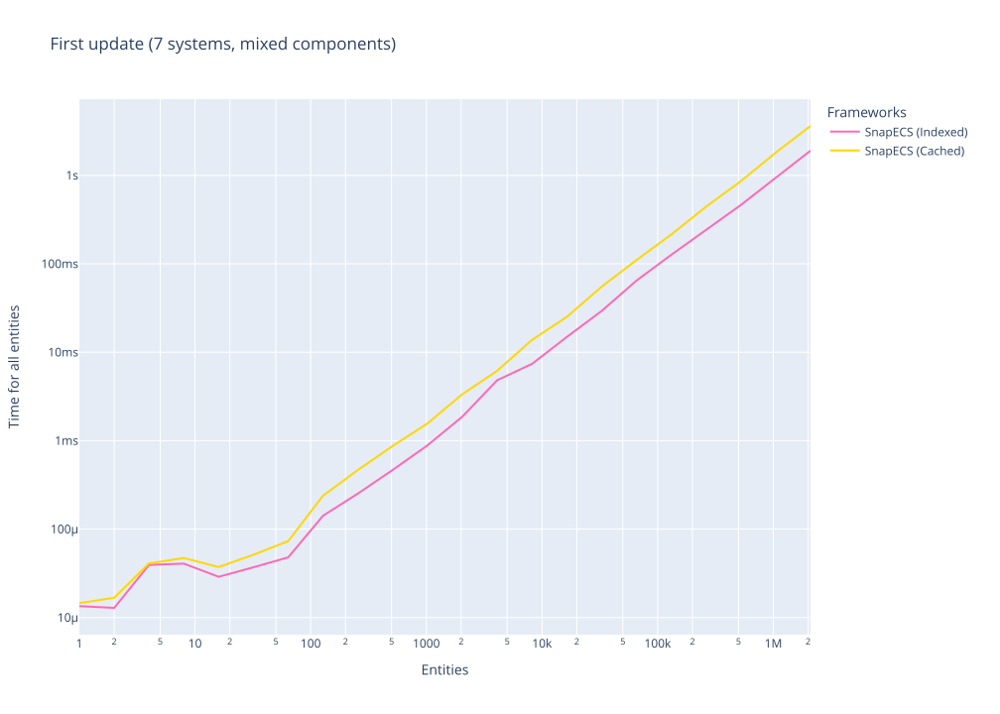 |

_Tables shows total cost. lower is faster._

|                                               | SnapECS (Indexed) | SnapECS (Cached) |
| :-------------------------------------------- | :---------------- | :--------------- |
| First update 1 mixed entities with 7 systems  | 13466ns           | 14566ns          |
| First update 4 mixed entities with 7 systems  | 39399ns           | 40966ns          |
| First update 8 mixed entities with 7 systems  | 40733ns           | 47166ns          |
| First update 16 mixed entities with 7 systems | 28933ns           | 37233ns          |
| First update 32 mixed entities with 7 systems | 37033ns           | 51366ns          |
| First update 64 mixed entities with 7 systems | 48033ns           | 73300ns          |

|                                                 | SnapECS (Indexed) | SnapECS (Cached) |
| :---------------------------------------------- | :---------------- | :--------------- |
| First update 256 mixed entities with 7 systems  | 252us             | 466us            |
| First update ~1K mixed entities with 7 systems  | 887us             | 1567us           |
| First update ~4K mixed entities with 7 systems  | 4828us            | 6171us           |
| First update ~16K mixed entities with 7 systems | 14890us           | 25086us          |

|                                                 | SnapECS (Indexed) | SnapECS (Cached) |
| :---------------------------------------------- | :---------------- | :--------------- |
| First update ~65K mixed entities with 7 systems | 64ms              | 110ms            |
| First update 262K mixed entities with 7 systems | 241ms             | 442ms            |
| First update ~1M mixed entities with 7 systems  | 938ms             | 1806ms           |
| First update ~2M mixed entities with 7 systems  | 1903ms            | 3619ms           |

## Contributing

If you have any improvements to the ECS-examples for any of the frameworks,
feel free to make a pull request or open an issue.
The example(s) for each framework can be found in [`src/`](src/), and benchmarks are located in [`benchmarks/benchmarks/`](benchmarks/benchmarks/) for more details.

Additionally, you can write tests for the framework example and add some metadata to the [plot.config.json](plot.config.json) file.
Any contributions are greatly appreciated!

_TODO: make more detailed "how to add framework"_

Read [CONTRIBUTING.md](CONTRIBUTING) for more details.

## Run Benchmarks

### Using [Taskfile](https://taskfile.dev/installation/)

0. Install [Taskfile](https://taskfile.dev/installation/)
1. Run Build: `task build`
2. Run (All) Benchmarks: `task benchmark`
3. Plot Graphs: `task plot:all`

Or run `task generate`

You can now find the benchmark-results in [`reports/`](reports/).

_You need python (>=3.8.0) and some [dependencies](scripts/gen-benchmark-report/requirements.txt) to run [gen-benchmark-report](scripts/gen-benchmark-report) (plotting), install [pipx](https://pipx.pypa.io/stable/installation/) and [poetry](https://python-poetry.org/docs/#installing-with-pipx)._

Then install the dependencies for the script:

```bash
cd ./scripts/gen-benchmark-report && poetry install
```

Or run the script directly:

```bash
task plot:all
```

#### Generate README

```bash
task generate:readme
```

### ~~Step-by-Step~~

1. Configure and build benchmarks, see [Building Details](doc/README_building.md):
   1. `cmake -S . -B ./build`
   2. `cmake --build ./build`
2. Run benchmark(s), with [`run-benchmarks.sh`](run-benchmarks.sh) or each:
   - `./build/benchmark/benchmarks/entt/ecs-benchmark-entt` _(console output)_ _(optional)_
   - `./build/benchmark/benchmarks/entt/ecs-benchmark-entt --benchmark_format=json > ./reports/entt.json` _(write json report)_
3. Plot Reports, after generating json reports, see [`plot-results.sh`](plot-results.sh):
   1. `pipx run --spec ./scripts/gen-benchmark-report gen-benchmark-report -i ./info.json gen-plot ./reports/entityx.json ./reports/entt.json ./reports/ginseng.json ./reports/flecs.json` _(generate graphs)_
   2. `pipx run --spec ./scripts/gen-benchmark-report gen-benchmark-report -i ./info.json gen-results-md ./reports/entityx.json ./reports/entt.json ./reports/ginseng.json ./reports/flecs.json` _(generate full report)_

### Run a single benchmark

```bash
cmake -G Ninja -S . -B build
cmake --build build --target ecs-benchmark-entt -j 4
./build/benchmark/benchmarks/entt/ecs-benchmark-entt
```

You can use `-DCMAKE_BUILD_TYPE=Debug` to enable Sanitizers.

## Links and More

- [Dependency Setup](doc/README_dependencies.md)
- [Building Details](doc/README_building.md)
- Project Template, mix of: [starter_template](https://github.com/cpp-best-practices/gui_starter_template) and [ModernCppStarter](https://github.com/TheLartians/ModernCppStarter)
  - [Forked cpp_vcpkg_project](https://github.com/abeimler/cpp_vcpkg_project)
- [Google benchmark](https://github.com/google/benchmark)
- https://github.com/SanderMertens/ecs-faq
- https://github.com/jslee02/awesome-entity-component-system

### Candidates

#### EntityX by @alecthomas

> Entity Component Systems (ECS) are a form of decomposition that completely decouples entity logic and data from the entity "objects" themselves. The Evolve your Hierarchy article provides a solid overview of EC systems and why you should use them.

Version: 1.1.2 (Apr 2023)

#### EnTT by @skypjack

> EnTT is a header-only, tiny and easy to use library for game programming and much more written in modern C++.

Version: v3.13.2

#### Ginseng by @apples

> Ginseng is an entity-component-system (ECS) library designed for use in games.

The main advantage over similar libraries is that the component types do not need to be listed or registered. Component types are detected dynamically.

Any function-like object can be used as a system. The function's parameters are used to determine the required components.

Version: 1.1 (Dec 2021)

#### Flecs by @SanderMertens

> Flecs is a fast and lightweight Entity Component System that lets you build games and simulations with millions of entities.

Version: v4.0.1

#### pico_ecs by @empyreanx

> A collection of cross-platform single header libraries written in C. Pure and simple ECS.

Version: 2.3 (Sep 2023)

#### gaia-ecs by @richardbiely

> Gaia-ECS is a fast and easy-to-use ECS framework.

Version: v0.8.6

#### SnapECS (Indexed)

> SnapECS using IndexedComponent storage for data components and TagComponent storage for empty components.

#### SnapECS (Cached)

> SnapECS using CachedComponent storage for data components and TagComponent storage for empty components.
